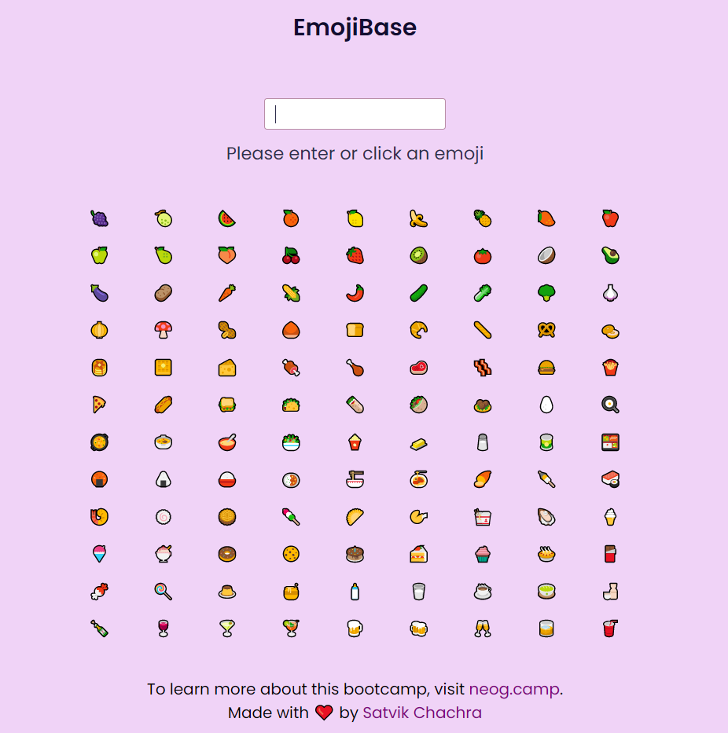

# EmojiBase
Curious about which emoji meanings you have been getting wrong all this time? Let us find out!
 
* Find meanings of different food emojis with this Web App.
* A part of submission of an assignment for neogcamp.

### View Live Demo
<pre><a href="https://satvikchachra-emojibase.netlify.app/"><b>satvikchachra-emojibase.netlify.app</b></a></pre>

### Features
* Search for an emoji and find its meaning
* Click on an emoji and find its meaning
* Error Handling for emojis not found in database.

### Image

  
Landing Page

    

Every day, people send billions of emojis to one another via texts.
 
We rely on these tiny images to communicate our thoughts, when we can’t see 🙈 or hear 🙉 who we’re texting.
 
Let's find out their right meaning.
 
This website illustrates the use of <b>useState</b> Hook in <b>ReactJS.</b>
 
 
Whether you 😍 or 😠 emojis, they’re a part of modern life. Here’s their meaning.
 
Have fun browsing!

##### Built with ♥ by <a href="https://github.com/satvikchachra">satvikchachra</a>

